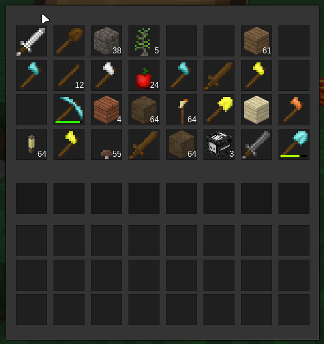
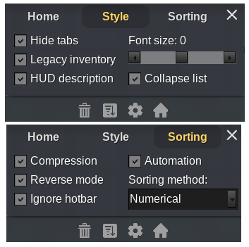

# Coolbar

Originally I made a simple mod that separates inventory from a bar, allowing you
to move things between them by shift-click, like in Minecraft. But because of
some technical specifics of the Minetest engine my mod was not really simple and
require significant changes to all mods that interact with inventory.

So I had the idea of a new mod (which you see now) that automatically manage
your inventory, removing all trash from the bar and putting your preferred items
on it, without affecting inventory structure, which makes it much mores
compatible with other mods.

As a result, it turned out to be very comfortable and easier than manual
shift-clicking!

## Explanation of behavior

- The mod has a preferences that specifies one or more types of items for each
  slot on the bar. However, these settings can also be empty.
- The mod doesn't work when moving items **FROM** player's inventory within the
  formspeck, which allows a player to move things between the bar and the rest
  of the inventory manually.
- Adding items to the bar manually temporarily replaces the slot settings with
  this item until it disappears from the bar for any reason.
- If an item not specified in the preferences ends up on the bar, it is moved to
  the inventory.
- If the number of items on the bar decreases, the mod tries to fill shortage
  from the inventory.

## Compatibility notes

For `i3` users I recommend to check all checkboxes in its settings:

`Mineclone` users needs to change `bar_size` from `8` to `9` and `inv_start`
from `9` to `10` in the mod settings.

## What can be improved

- The engine can not keep track of some inventory changes made manually from
  mods, so I need to provide additional compatibility for some of them.
- The order of items in the settings is currently irrelevant. Maintaining a
  strict order is not easy task, requiring to rewrite half the code backwards.
- Would be cool to add the ability to automatically change settings depending on
  the loaded game.
